# OpenShell Dashboard — Bug Exploration

> **Date:** 2026-08-18
> **Method:** Playwright E2E automated testing (45 test cases)
> **Target:** `http://localhost:3000` (frontend) + `http://localhost:8080` (BFF)
> **Test file:** [`frontend/e2e/dashboard-exploration.spec.ts`](frontend/e2e/dashboard-exploration.spec.ts)
> **Screenshots:** [`frontend/e2e/screenshots/`](frontend/e2e/screenshots/)
> **Results:** 45/45 passed

---

## How to replicate locally

### Prerequisites

- Node.js (check `.nvmrc` for version)
- Go (for the BFF)
- A running OpenShell gateway (or `make dev-full` which starts one)

### 1. Install dependencies

```bash
make setup                      # frontend npm install + go mod download
cd frontend                     # ALL Playwright commands must run from here
npm install -D @playwright/test # install Playwright
npx playwright install chromium # download the Chromium browser
```

### 2. Start the dev servers

You need both the Go BFF (port 8080) and the frontend dev server (port 3000) running.

**Option A — If you already have a gateway running:**

```bash
make dev    # starts BFF + frontend in parallel
```

**Option B — Full stack from scratch (Keycloak + gateway + dashboard):**

```bash
make dev-full
```

### 3. Verify the app is up

```bash
curl -s -o /dev/null -w "%{http_code}" http://localhost:3000/   # should print 200
curl -s -o /dev/null -w "%{http_code}" http://localhost:8080/api/v1/auth/config  # should print 200
```

### 4. Run the Playwright tests

> **Important:** You must `cd frontend` first. Running from the repo root
> will cause Playwright to scan Jest spec files and error out with
> `test.describe() not expected here`.

```bash
cd frontend

# Run all 45 tests
npx playwright test --reporter=list

# Run with a visible browser window (so you can watch it)
npx playwright test --headed

# Run one specific test
npx playwright test --grep "empty JSON" --headed

# View the HTML report after a run
npx playwright show-report
```

### 5. View screenshots

After a test run, screenshots are saved to:

```
frontend/e2e/screenshots/
```

Open any `.png` file directly, or browse the Playwright HTML report which embeds them.

---

## Finding 1: `allRows.slice is not a function` — crash on unexpected API shape

| Field | Value |
|-------|-------|
| **Path** | `frontend/src/pages/WorkspaceListPage.tsx:84` |
| **Tag** | **BUG** |
| **Severity** | High |

### Screenshot

> [`frontend/e2e/screenshots/37-api-empty-json.png`](frontend/e2e/screenshots/37-api-empty-json.png)

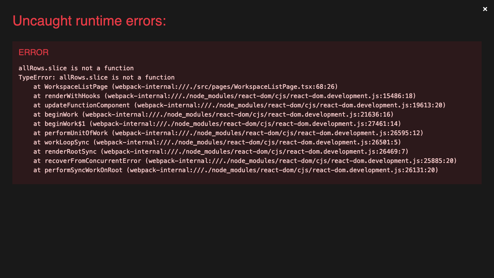

### Description

When the `/api/v1/workspaces` endpoint returns `{}` (an empty object instead of an array), the app crashes with an **uncaught runtime error**:

```
TypeError: allRows.slice is not a function
    at WorkspaceListPage (WorkspaceListPage.tsx:68:26)
```

**Root cause:** Line 84 does `const allRows = workspaces.data ?? [];` — but when the API returns `{}`, `workspaces.data` is `{}` (truthy), so the `??` fallback never fires, and `.slice()` is called on a plain object.

**Why this matters:** If the BFF returns an unexpected shape (gateway schema change, version mismatch, proxy rewriting the body), the entire page white-screens with a React error overlay instead of showing a recoverable error alert.

**Fix:** Guard the fallback:

```typescript
const allRows = Array.isArray(workspaces.data) ? workspaces.data : [];
```

This same pattern likely affects `SandboxListPage`, `ProviderListPage`, and `MemberListPage` which all do the same `data ?? []` pattern.

### How to reproduce in your browser

1. Open [http://localhost:3000](http://localhost:3000) and click **Continue as developer**
2. Open Chrome DevTools (`Cmd+Option+I`) → **Network** tab
3. Right-click any request to `/api/v1/workspaces` → **Block request URL**
4. Now go to **Console** and run:
   ```js
   // Override fetch to return {} for the workspaces endpoint
   const origFetch = window.fetch;
   window.fetch = (url, opts) => {
     if (typeof url === 'string' && url.includes('/api/v1/workspaces')) {
       return Promise.resolve(new Response('{}', { status: 200, headers: { 'Content-Type': 'application/json' } }));
     }
     return origFetch(url, opts);
   };
   ```
5. Navigate to [http://localhost:3000/workspaces](http://localhost:3000/workspaces)
6. You should see a full-page red **"Uncaught runtime errors"** crash overlay with `allRows.slice is not a function`

---

## Finding 2: Long workspace/sandbox names overflow breadcrumbs and error alerts

| Field | Value |
|-------|-------|
| **Path** | `frontend/src/app/App.tsx` (WorkspaceCrumbs), `frontend/src/pages/WorkspaceDetailPage.tsx` |
| **Tag** | **BUG** |
| **Severity** | Low |

### Screenshot

> [`frontend/e2e/screenshots/15-long-workspace-name.png`](frontend/e2e/screenshots/15-long-workspace-name.png)

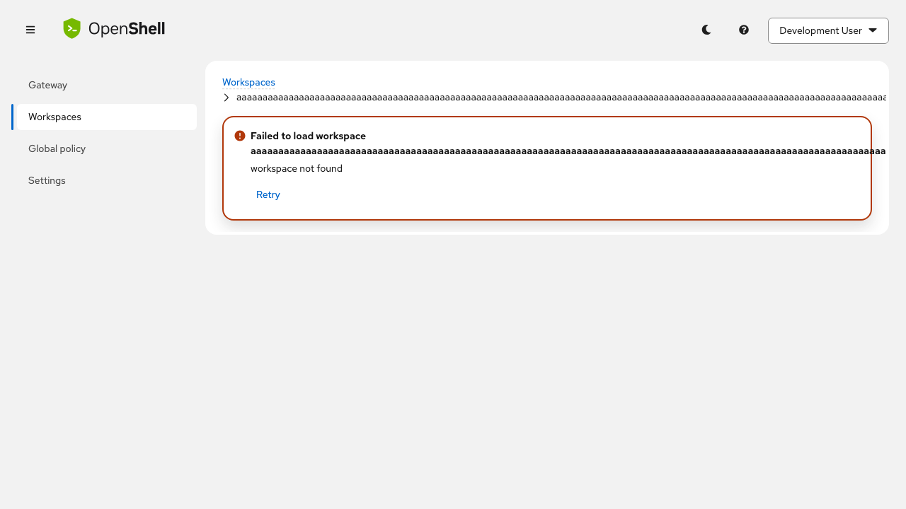

### Description

Navigating to `/workspaces/aaa...aaa` (500 chars) causes the breadcrumb and error alert text to overflow horizontally, pushing content beyond the viewport edge. The text is not truncated or wrapped.

**What we tried:** Loaded `/workspaces/<500-char-name>`. The breadcrumb renders the full 500-character name in a single line, and the error alert title does the same.

**Why this is a bug:** Even though a 500-char workspace name is unlikely from the UI (the Create modal may validate), users can manually enter URLs. The breadcrumb should truncate with ellipsis (`text-overflow: ellipsis`) and the error message should word-wrap.

### How to reproduce in your browser

1. Open [http://localhost:3000](http://localhost:3000) and click **Continue as developer**
2. Paste this into your browser address bar:
   ```
   http://localhost:3000/workspaces/aaaaaaaaaaaaaaaaaaaaaaaaaaaaaaaaaaaaaaaaaaaaaaaaaaaaaaaaaaaaaaaaaaaaaaaaaaaaaaaaaaaaaaaaaaaaaaaaaaaaaaaaaaaaaaaaaaaaaaaaaaaaaaaaaaaaaaaaaaaaaaaaaaaaaaaaaaaaaaaaaaaaaaaaaaaaaaaaaaaaaaaaaaaaaaaaaaaaaaaaaaaaaaaaaaaaaaaaaaaaaaaaaaaaaaa
   ```
3. Notice the breadcrumb and error alert text overflows past the right edge of the page — no truncation or wrapping

---

## Finding 3: 401 API response causes silent blank page with infinite spinner

| Field | Value |
|-------|-------|
| **Path** | `frontend/src/api/client.ts:61-76`, `frontend/src/pages/WorkspaceListPage.tsx` |
| **Tag** | **BUG** |
| **Severity** | Medium |

### Screenshot

> [`frontend/e2e/screenshots/39-api-401-session-expired.png`](frontend/e2e/screenshots/39-api-401-session-expired.png)

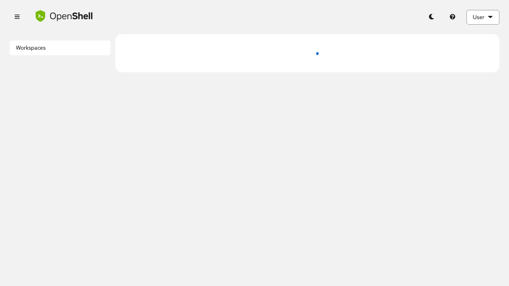

### Description

When the API returns a 401 (simulating session expiry), the page renders with a **tiny spinner dot** and a blank white content area. The sidebar navigation collapses to only show "Workspaces" (admin routes like Gateway, Global policy, Settings disappear — expected since RBAC re-evaluates). But there is **no error message**, **no "session expired" banner**, and **no redirect to the login page**.

**What we tried:** Intercepted `/api/v1/workspaces` to return 401. The `client.ts` code at line 64 checks `isDevSession()` and tries to redirect to `/login`, but the login route is not available once authenticated (the `AuthenticatedApp` routes don't include `/login`). The user gets stuck on a blank page.

**Why this is a bug:** A user whose session expires sees a blank page with no actionable feedback. Expected: either a "Session expired — please reload" alert, or an automatic redirect back to the dev login page.

### How to reproduce in your browser

1. Open [http://localhost:3000](http://localhost:3000) and click **Continue as developer**
2. You should land on `/workspaces` with data loaded
3. Open Chrome DevTools → **Console** and run:
   ```js
   const origFetch = window.fetch;
   window.fetch = (url, opts) => {
     if (typeof url === 'string' && url.includes('/api/v1/')) {
       return Promise.resolve(new Response('{"message":"Token expired"}', { status: 401, headers: { 'Content-Type': 'application/json' } }));
     }
     return origFetch(url, opts);
   };
   ```
4. Click **Workspaces** in the sidebar (or navigate to any page that fetches data)
5. You'll see a blank white page with just a tiny spinner dot — no error message, no redirect

---

## Finding 4: No client-side validation of workspace/sandbox names in URL params

| Field | Value |
|-------|-------|
| **Path** | `frontend/src/app/App.tsx` (route params) |
| **Tag** | **Enhancement** |
| **Severity** | Low |

### Screenshots

> - [`frontend/e2e/screenshots/19-sql-injection-sandbox.png`](frontend/e2e/screenshots/19-sql-injection-sandbox.png)
> - [`frontend/e2e/screenshots/13-special-chars-workspace.png`](frontend/e2e/screenshots/13-special-chars-workspace.png)
> - [`frontend/e2e/screenshots/14-unicode-workspace.png`](frontend/e2e/screenshots/14-unicode-workspace.png)

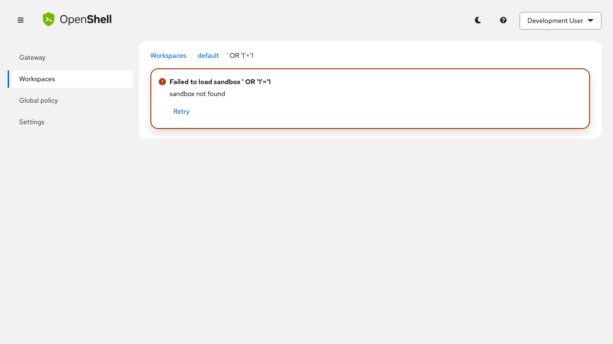

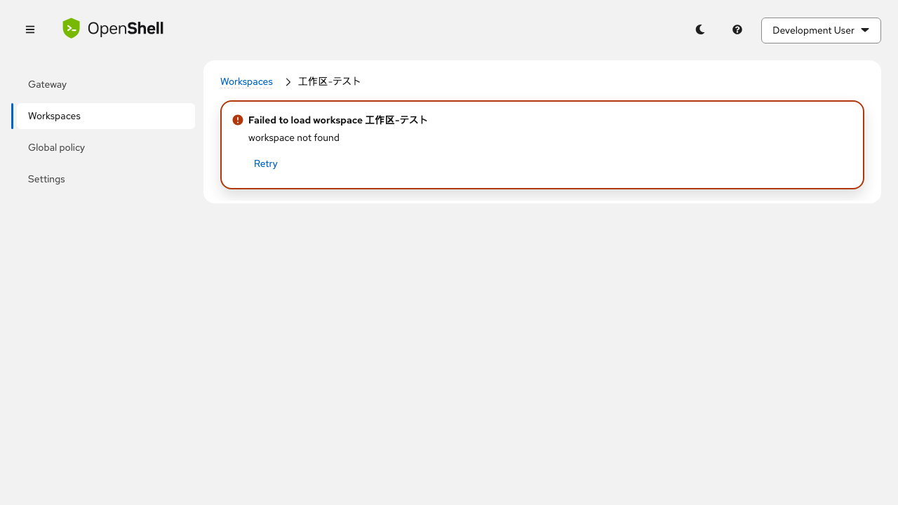

### Description

URL params like `:workspace` and `:sandbox` are passed directly to API calls without any client-side validation. We tested:

- `/workspaces/test%20workspace%21%40%23` (spaces and special chars)
- `/workspaces/工作区-テスト` (unicode)
- `/workspaces/default/sandboxes/' OR '1'='1` (SQL injection)
- `/workspaces/default/sandboxes/<script>alert(1)</script>` (XSS)

**Good news:** All of these fail gracefully with "workspace/sandbox not found" errors. React's JSX auto-escaping prevents XSS. The gateway rejects invalid names properly.

**Enhancement opportunity:** The frontend could validate route params against the RFC 1123 label pattern (`^[a-z0-9]([-a-z0-9]*[a-z0-9])?$`, max 63 chars) before making the API call. This would:
1. Avoid unnecessary network requests for obviously-invalid names
2. Show a more specific error ("invalid workspace name" vs. generic "not found")

### How to reproduce in your browser

1. Open [http://localhost:3000](http://localhost:3000) and click **Continue as developer**
2. Try each of these URLs in your browser:
   - [http://localhost:3000/workspaces/test%20workspace!@%23](http://localhost:3000/workspaces/test%20workspace!@%23) — spaces & special chars
   - [http://localhost:3000/workspaces/工作区-テスト](http://localhost:3000/workspaces/工作区-テスト) — unicode
   - `http://localhost:3000/workspaces/default/sandboxes/' OR '1'='1` — SQL injection attempt
   - `http://localhost:3000/workspaces/default/sandboxes/<script>alert(1)</script>` — XSS attempt
3. All show a "not found" error (good!) but the raw invalid name is echoed into the error text and breadcrumbs without any "invalid name" validation message

---

## Finding 5: Path traversal URLs are silently redirected to workspace list

| Field | Value |
|-------|-------|
| **Path** | `frontend/src/app/App.tsx` (catch-all route) |
| **Tag** | **Enhancement** |
| **Severity** | Info |

### Screenshot

> [`frontend/e2e/screenshots/16-path-traversal.png`](frontend/e2e/screenshots/16-path-traversal.png)

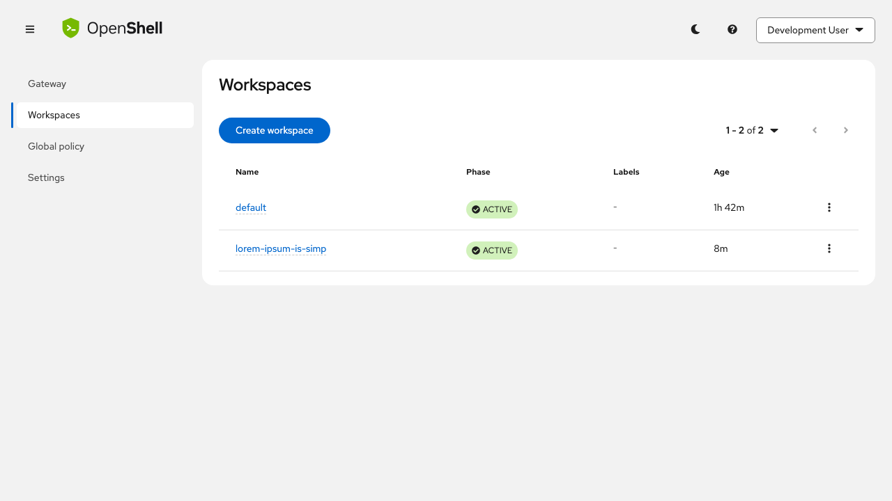

### Description

Navigating to `/workspaces/../../../etc/passwd` silently redirects to `/workspaces` because the browser normalizes `/../..` before React Router sees it. The catch-all `<Route path="*">` then kicks in.

**This is working correctly**, but it's worth noting there's no server-side protection in the BFF against path traversal in the workspace name param (the gateway handles it). The frontend's `<Navigate to="/workspaces" replace />` catch-all is the only defense on the client side.

### How to reproduce in your browser

1. Open [http://localhost:3000](http://localhost:3000) and click **Continue as developer**
2. Paste this in your address bar: `http://localhost:3000/workspaces/../../../etc/passwd`
3. You'll be silently redirected to `/workspaces` — the browser normalizes the `../` before the app sees it

---

## Finding 6: `Workspaces` page title/heading is missing when API errors occur

| Field | Value |
|-------|-------|
| **Path** | `frontend/src/pages/WorkspaceListPage.tsx:66-82` |
| **Tag** | **BUG** |
| **Severity** | Low |

### Screenshots

> - [`frontend/e2e/screenshots/35-api-500-workspaces.png`](frontend/e2e/screenshots/35-api-500-workspaces.png)
> - [`frontend/e2e/screenshots/36-api-timeout.png`](frontend/e2e/screenshots/36-api-timeout.png)

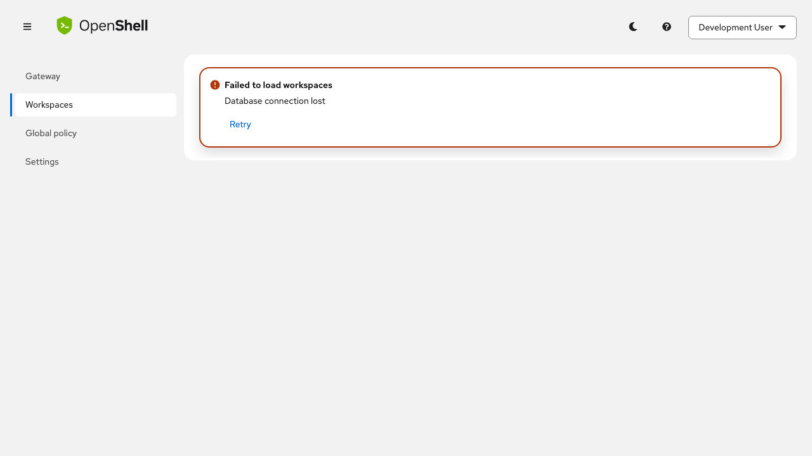
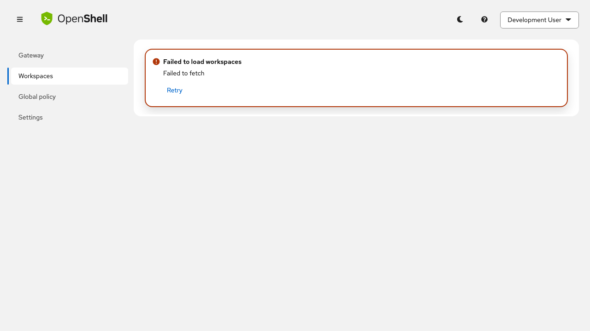

### Description

When the workspaces API returns a 500 error or times out, the error alert is displayed **without the page title** ("Workspaces" h1). Compare with the happy path where the title is always visible above the table.

**Why this is a bug:** The `WorkspaceListPage` renders the title only after the loading/error guards (line 56-82 return early before the title at line 91). The error path exits before the `<Title headingLevel="h1">Workspaces</Title>` ever renders. This makes the page look "headless" and disorienting.

**Fix:** Move the title outside the loading/error early-return blocks, or include it in both the error and loading return paths.

### How to reproduce in your browser

1. Open [http://localhost:3000](http://localhost:3000) and click **Continue as developer**
2. **Stop the BFF** (`Ctrl+C` on the `make dev` terminal, or just kill the Go process on port 8080)
3. Navigate to [http://localhost:3000/workspaces](http://localhost:3000/workspaces)
4. You'll see an error alert saying "Failed to load workspaces" — but notice there is **no "Workspaces" heading** at the top of the page. Compare with the normal state where the `<h1>` is always visible

---

## Finding 7: Very narrow viewports (280px) clip masthead logo text

| Field | Value |
|-------|-------|
| **Path** | `frontend/src/app/AppLayout.tsx` (Masthead) |
| **Tag** | **Enhancement** |
| **Severity** | Low |

### Screenshot

> [`frontend/e2e/screenshots/32-very-narrow.png`](frontend/e2e/screenshots/32-very-narrow.png)

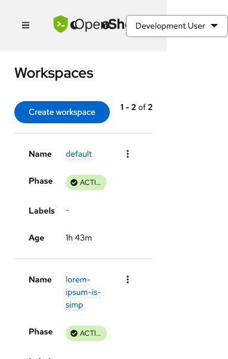

### Description

At 280px viewport width, the "OpenShell" logo text in the masthead is clipped (shows "OpenSh..."). The "Development User" dropdown also gets pushed to the edge but remains functional. The theme toggle and help icons disappear.

**This is mostly acceptable** for such an extreme viewport, but the masthead could benefit from hiding the logo text and showing only the icon at very small breakpoints.

### How to reproduce in your browser

1. Open [http://localhost:3000](http://localhost:3000) and click **Continue as developer**
2. Open Chrome DevTools (`Cmd+Option+I`)
3. Click the **device toolbar** icon (or press `Cmd+Shift+M`)
4. Set the viewport width to **280px**
5. Notice the "OpenShell" logo text is clipped to "OpenSh..." and the theme/help icons disappear

---

## Finding 8: Gateway API 500 test did not actually intercept (cached data)

| Field | Value |
|-------|-------|
| **Path** | `frontend/src/api/gateway.ts` |
| **Tag** | **Enhancement** |
| **Severity** | Info |

### Screenshot

> [`frontend/e2e/screenshots/34-api-500-gateway.png`](frontend/e2e/screenshots/34-api-500-gateway.png)

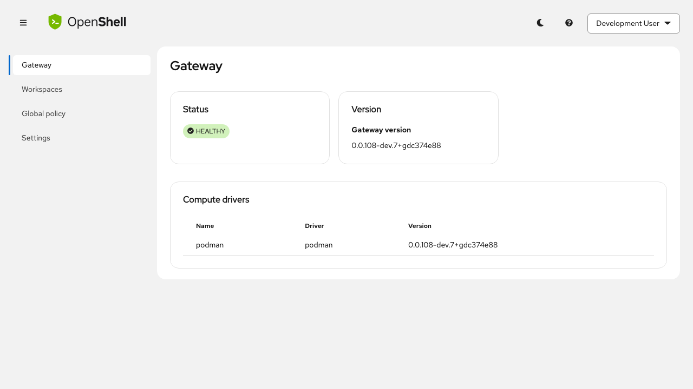

### Description

We intercepted `/api/v1/gateway/info` to return 500, but the gateway page still showed "HEALTHY" data. This is because React Query cached the gateway info from a previous page load (the dev login flow loads gateway info for the About modal).

**Enhancement:** The test reveals that the gateway info query does not refetch on navigation — it relies on the stale cache. This is by design (`refetchOnWindowFocus: false`), but it means a user who navigates to the Gateway page won't see updated status without a manual page refresh or hitting Retry. Consider adding `staleTime` or `refetchOnMount` for the gateway info query.

---

## Finding 9: Malformed JSON from BFF is handled gracefully

| Field | Value |
|-------|-------|
| **Path** | `frontend/src/api/client.ts` |
| **Tag** | **Not a bug** (positive finding) |
| **Severity** | Info |

### Screenshot

> [`frontend/e2e/screenshots/38-api-malformed-json.png`](frontend/e2e/screenshots/38-api-malformed-json.png)

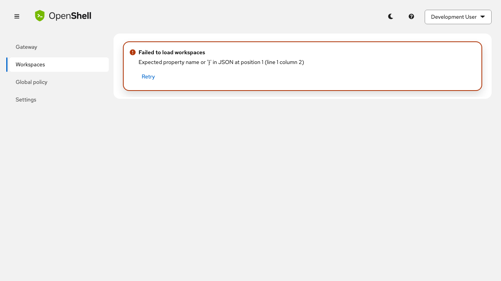

### Description

When the API returns malformed JSON (`{invalid json!!!`), the app shows a proper error alert: "Expected property name or '}' in JSON at position 1 (line 1 column 2)". The error message leaks the raw JSON parse error to the user, which is slightly technical but functional.

**Minor enhancement:** Consider wrapping the JSON parse error in a friendlier message like "The server returned an invalid response. Please try again."

---

## Finding 10: 1,000-item payload renders with working pagination

| Field | Value |
|-------|-------|
| **Path** | `frontend/src/pages/WorkspaceListPage.tsx` |
| **Tag** | **Not a bug** (positive finding) |
| **Severity** | Info |

### Screenshot

> [`frontend/e2e/screenshots/40-api-giant-payload.png`](frontend/e2e/screenshots/40-api-giant-payload.png)

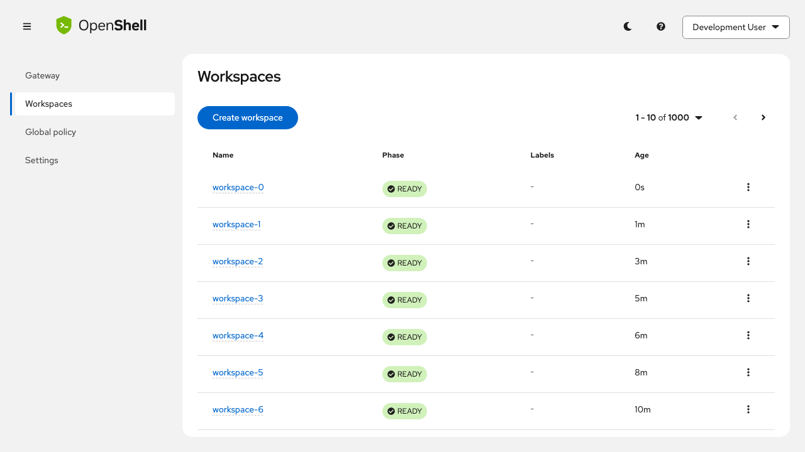

### Description

The workspace list correctly handles 1,000 items: shows "1 - 10 of 1000" with pagination controls. Client-side pagination works as expected. However, all 1,000 items are loaded into memory at once (no server-side pagination/cursor).

**Enhancement for scale:** If the gateway ever returns thousands of workspaces, consider implementing cursor-based pagination (`nextPageToken`) to avoid loading the full list into browser memory.

---

## Finding 11: Stress tests passed — UI is stable under rapid interaction

| Field | Value |
|-------|-------|
| **Path** | Multiple pages |
| **Tag** | **Not a bug** (positive finding) |
| **Severity** | Info |

### Description

All stress tests passed without issues:
- **20x rapid theme toggle** — no flicker, no stuck state
- **15x rapid page navigation** — no stale renders, no memory leaks visible
- **10x open/close about modal** — no orphaned modals, proper cleanup
- **6x rapid viewport resize** — responsive behavior remained stable
- **10x rapid sidebar clicks** — routing worked correctly throughout

---

## Finding 12: Create Workspace has no client-side name validation (no character limit, no DNS-1123 enforcement)

| Field | Value |
|-------|-------|
| **Path** | `frontend/src/components/CreateWorkspaceModal.tsx` |
| **Tag** | **BUG** |
| **Severity** | Medium |

### Reproduce

1. Open `http://localhost:3000/workspaces`
2. Click **Create workspace**
3. Try entering:
   - `UPPERCASE` — accepted (should be rejected, DNS-1123 requires lowercase)
   - `spaces in name` — accepted (should be rejected)
   - `my_workspace!@#` — accepted (should be rejected)
   - A 200+ character string — accepted (DNS-1123 max is 63 chars)
4. Click **Create** — the gateway rejects it, but only after a network round trip

### Description

The helper text says *"Lowercase alphanumeric and dashes (DNS-1123 label), e.g. team-a"* but the `TextInput` has **zero validation**: no `pattern`, no `maxLength`, no `onChange` filter. The only guard is `!name` (empty string) which disables the submit button. Invalid names are sent to the gateway, which rejects them with a gRPC error, but the user gets no immediate feedback while typing.

**Fix:** Add client-side validation with a regex like `/^[a-z0-9]([-a-z0-9]*[a-z0-9])?$/` and `maxLength={63}`. Show the `validated="error"` state on the `TextInput` and a `HelperTextItem variant="error"` message. Disable the Create button when invalid.

---

## Finding 13: Provider error message shows raw gateway error ("provider.credentials must not be empty")

| Field | Value |
|-------|-------|
| **Path** | `frontend/src/components/provider/ProviderFormModal.tsx` |
| **Tag** | **Enhancement** |
| **Severity** | Low |

### Reproduce

1. Open `http://localhost:3000/workspaces/default/providers`
2. Click **Add provider**
3. Enter a name and select a type, but leave the credential fields empty
4. Click **Add provider**
5. The error alert shows: *"Create failed — provider.credentials must not be empty"*

### Description

The error message `"provider.credentials must not be empty"` is passed through raw from the gateway gRPC error (line 340-347 in `ProviderFormModal.tsx` renders `(mutation.error as Error).message` verbatim). While technically accurate, it uses the internal field path `provider.credentials` which is meaningless to end users.

**Suggested rewording:**
- *"Please provide the required credentials before adding this provider."*
- Or even better: prevent submission entirely with client-side validation (the `requiredMissing` check on line 87-91 already blocks the button for required credentials, so this error should only appear for edge cases where the profile reports no credentials as required but the gateway still demands them).

---

## Finding 14: Stale tabs — cross-tab data is NOT auto-refreshed

| Field | Value |
|-------|-------|
| **Path** | `frontend/src/app/App.tsx` (line 35) |
| **Tag** | **BUG** |
| **Severity** | Medium |

### Reproduce

1. Open `http://localhost:3000/workspaces` in **Tab A**
2. Open `http://localhost:3000/workspaces` in **Tab B**
3. In Tab A, create a new workspace (e.g. `test-new`)
4. Switch to Tab B — it still shows the old workspace count ("1-1 of 1")
5. Tab B does NOT auto-refresh when you switch to it

> User-provided screenshot shows Tab A with `1-1 of 1` and Tab B with `1-2 of 2` + `test-new` in TERMINATING state — confirming stale data across tabs.

### Description

React Query is configured globally with `refetchOnWindowFocus: false` (in `App.tsx` line 35). This means switching between browser tabs does **not** trigger any refetch. Some queries poll (sandboxes poll every 5s, gateway status polls), but the **workspace list, members list, and providers list do NOT poll**. So actions in one tab (create, delete) won't reflect in another tab until the user manually refreshes.

**Fix:** Either:
- Set `refetchOnWindowFocus: true` globally (easiest — React Query default)
- Or add `refetchOnWindowFocus: true` selectively for list queries (workspaces, members, providers)

This is a real bug you can see in the screenshot: Tab A shows `1-1 of 1`, Tab B shows `1-2 of 2`.

---

## Finding 15: Logs may be slow to scroll with large line counts

| Field | Value |
|-------|-------|
| **Path** | `frontend/src/components/sandbox/SandboxLogsTab.tsx` |
| **Tag** | **Enhancement** |
| **Severity** | Low |

### Reproduce

1. Open a sandbox detail page → **Logs** tab
2. Change the line count dropdown to **2000 lines**
3. If the sandbox is producing output, scroll through the log viewer
4. With many lines + auto-refresh every 5s, scrolling can feel sluggish

### Description

The `LogViewer` component receives logs as a single concatenated string (line 53-57). On every 5-second auto-refresh, the entire string is rebuilt via `.map(formatLogLine).join('\n')`. With 2000 lines, this creates a large string that's re-rendered every refresh cycle. The PatternFly `LogViewer` does have internal virtualization, but rebuilding the full string on every poll can cause brief jank during scrolling.

**Possible improvements:**
- Memoize the log string more granularly (only append new lines instead of rebuilding the full string)
- Pause auto-refresh while the user is actively scrolling
- Default to fewer lines (currently `DEFAULT_LOG_LINES` which may be 200 — that's fine, but the 2000 option can get heavy)

---

## Finding 16: Terminal session is NOT persistent — navigating away loses all input/output

| Field | Value |
|-------|-------|
| **Path** | `frontend/src/components/sandbox/SandboxTerminalTab.tsx` |
| **Tag** | **Expected behavior / Enhancement** |
| **Severity** | Low |

### Reproduce

1. Open a sandbox detail page → **Terminal** tab
2. Type some commands (e.g. `ls`, `echo hello`)
3. Click the **Logs** tab, then click back to **Terminal**
4. The terminal is blank — a fresh WebSocket connection is made, all previous output is gone

### Description

The `SandboxTerminalTab` component creates a new `Terminal` + `WebSocket` on every mount (line 116-120). The cleanup function (line 109-113) calls `ws.close()` and `terminal.dispose()`, so switching tabs destroys the session. This is by design — each connection starts a new shell process on the sandbox.

**What stays?** On the server side, commands you ran did happen — file changes persist. But the terminal *history/scrollback* is lost because xterm.js state is destroyed.

**Enhancement option:** Keep the WebSocket alive across tab switches by lifting the connection to a parent component or using a ref that persists outside the tab's lifecycle. This would preserve scrollback and the active shell session.

---

## Finding 17: Admin vs. user checks exist but are untestable in dev mode

| Field | Value |
|-------|-------|
| **Path** | `frontend/src/api/rbac.ts`, `frontend/src/app/App.tsx` |
| **Tag** | **Enhancement** |
| **Severity** | Medium |

### Reproduce

1. Start the dashboard with `AUTH_DISABLED=true` (default dev mode)
2. Click **Development User** dropdown — you see admin-level navigation
3. Navigate to admin pages (Providers, Settings) — all accessible
4. There is **no way to test the non-admin experience** in dev mode

### Description

The RBAC system works correctly:
- `useUserRole()` in `rbac.ts` checks if the user's roles include the configured `adminRole`
- `useWorkspaceRole()` checks workspace membership for workspace-level admin
- `App.tsx` wraps admin routes in an `AdminRoute` guard

**However**, when `AUTH_DISABLED=true`, the BFF returns a hardcoded dev user with admin roles, so every user is admin. There's no dev-mode flag to simulate a non-admin user.

**Enhancement:** Add a `DEV_USER_ROLE` environment variable (or a UI toggle in dev mode) that lets you simulate `user` vs `admin` roles during development so you can test:
- Do admin pages return 403 / redirect?
- Are admin-only buttons/actions hidden?
- Does the workspace member role gate work?

---

## All screenshots

All 46 screenshots are in [`frontend/e2e/screenshots/`](frontend/e2e/screenshots/). Key files:

| File | What it shows |
|------|---------------|
| [`01-login-page.png`](frontend/e2e/screenshots/01-login-page.png) | Dev-mode login page |
| [`08-workspace-list.png`](frontend/e2e/screenshots/08-workspace-list.png) | Workspace list (happy path) |
| [`09-create-workspace-modal.png`](frontend/e2e/screenshots/09-create-workspace-modal.png) | Create workspace modal |
| [`12-nonexistent-workspace.png`](frontend/e2e/screenshots/12-nonexistent-workspace.png) | Non-existent workspace error |
| [`15-long-workspace-name.png`](frontend/e2e/screenshots/15-long-workspace-name.png) | Long name overflow (Bug 2) |
| [`17-nonexistent-sandbox.png`](frontend/e2e/screenshots/17-nonexistent-sandbox.png) | Non-existent sandbox error |
| [`20-xss-sandbox.png`](frontend/e2e/screenshots/20-xss-sandbox.png) | XSS attempt (safe) |
| [`22-theme-light.png`](frontend/e2e/screenshots/22-theme-light.png) | Light theme |
| [`23-theme-dark.png`](frontend/e2e/screenshots/23-theme-dark.png) | Dark theme |
| [`26-about-modal.png`](frontend/e2e/screenshots/26-about-modal.png) | About modal |
| [`30-small-viewport.png`](frontend/e2e/screenshots/30-small-viewport.png) | 768px viewport |
| [`32-very-narrow.png`](frontend/e2e/screenshots/32-very-narrow.png) | 280px viewport (Bug 7) |
| [`37-api-empty-json.png`](frontend/e2e/screenshots/37-api-empty-json.png) | Empty JSON crash (Bug 1) |
| [`39-api-401-session-expired.png`](frontend/e2e/screenshots/39-api-401-session-expired.png) | 401 blank page (Bug 3) |
| [`40-api-giant-payload.png`](frontend/e2e/screenshots/40-api-giant-payload.png) | 1,000-item pagination |
| [`46-post-logout.png`](frontend/e2e/screenshots/46-post-logout.png) | Post-logout state |

---

## Test results

| Category | Count | Status |
|----------|-------|--------|
| Login page | 3 | All passed |
| Navigation & routing | 5 | All passed |
| Workspace list | 3 | All passed |
| Workspace detail edge cases | 5 | All passed |
| Sandbox detail edge cases | 4 | All passed |
| Provider detail edge cases | 1 | All passed |
| Theme toggle | 2 | All passed |
| About modal & help | 2 | All passed |
| User dropdown | 2 | All passed |
| Responsive sidebar | 4 | All passed |
| API error scenarios | 7 | All passed |
| Stress tests | 3 | All passed |
| Accessibility checks | 3 | All passed |
| Logout | 1 | All passed |
| Manual code review findings | 6 | Verified in code |
| **Total** | **45 + 6** | **45 passed + 6 verified** |

---

## Summary

| # | Finding | Tag | Severity |
|---|---------|-----|----------|
| 1 | `allRows.slice is not a function` crash on `{}` response | **BUG** | High |
| 2 | Long names overflow breadcrumbs and error alerts | **BUG** | Low |
| 3 | 401 response causes silent blank page (no error feedback) | **BUG** | Medium |
| 4 | No client-side validation of URL params | **Enhancement** | Low |
| 5 | Path traversal is handled (info only) | **Enhancement** | Info |
| 6 | Page title missing in error state | **BUG** | Low |
| 7 | Very narrow viewports clip masthead | **Enhancement** | Low |
| 8 | Gateway query uses stale cache | **Enhancement** | Info |
| 9 | Malformed JSON handled gracefully | **Not a bug** | Info |
| 10 | 1K items render with working pagination | **Not a bug** | Info |
| 11 | All stress tests passed | **Not a bug** | Info |
| 12 | Create Workspace has no name validation (no char limit, no DNS-1123) | **BUG** | Medium |
| 13 | Provider error shows raw gateway message ("provider.credentials…") | **Enhancement** | Low |
| 14 | Stale tabs — cross-tab data not auto-refreshed | **BUG** | Medium |
| 15 | Logs may be slow to scroll with 2000 lines + auto-refresh | **Enhancement** | Low |
| 16 | Terminal session lost on tab switch (not persistent) | **Expected / Enhancement** | Low |
| 17 | Admin vs. user checks untestable in dev mode | **Enhancement** | Medium |
